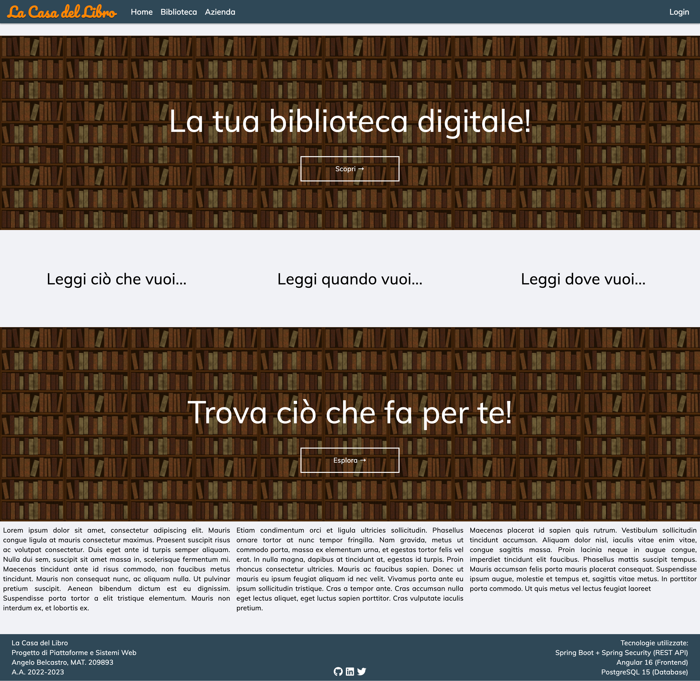
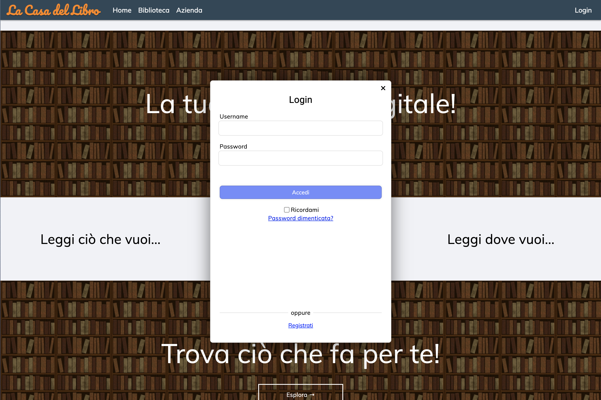
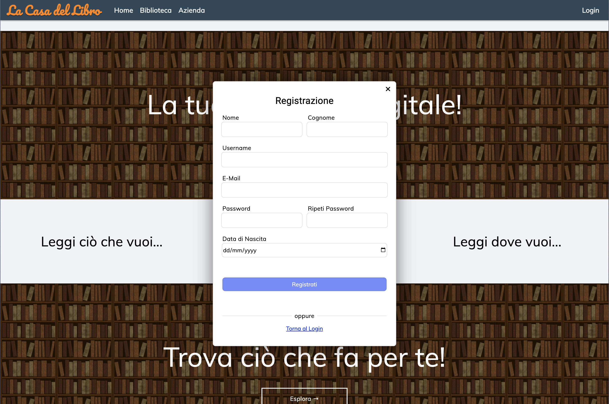
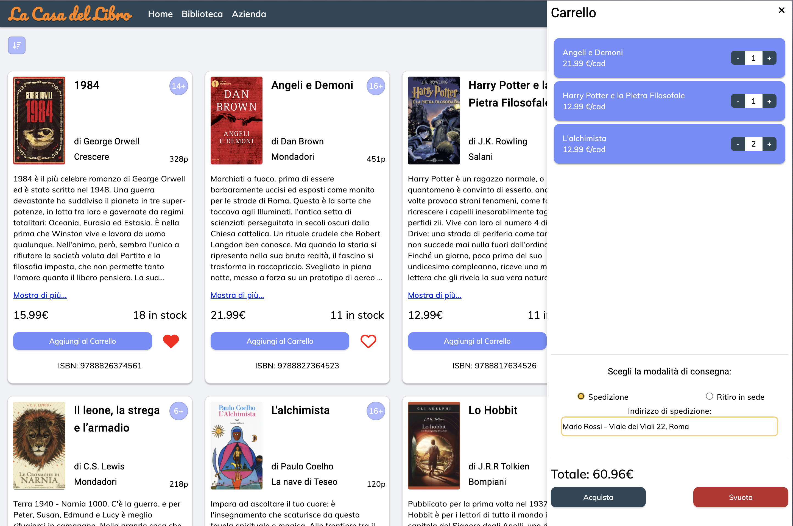
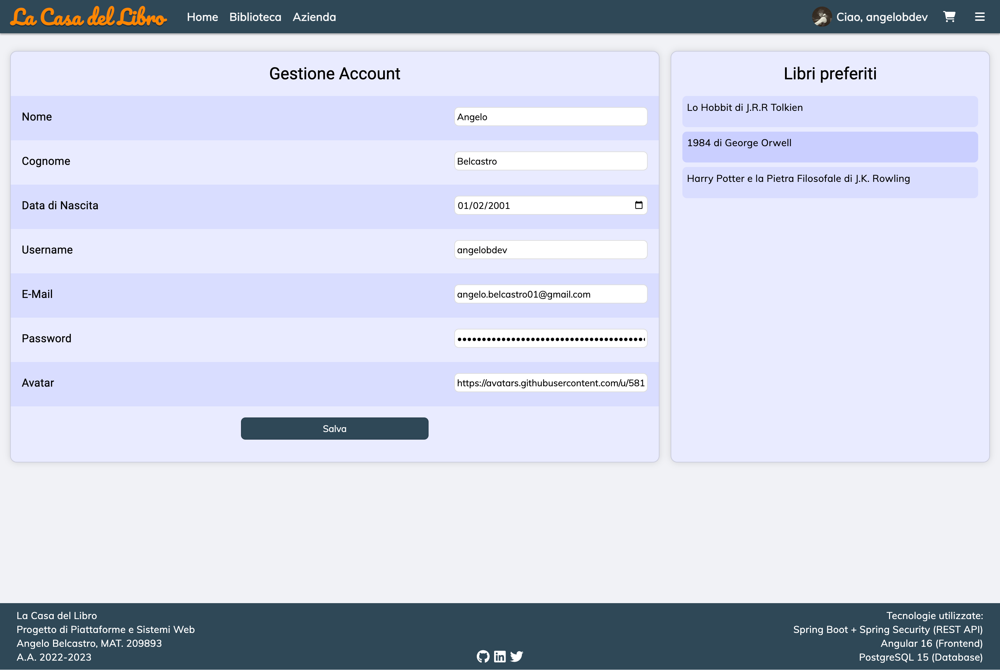

# Casa del Libro

Progetto di Piattaforme Software e Applicazioni su Web  
Angelo Belcastro

---
### Tecnologie utilizzate:
- Angular 16 (frontend)
- Spring Boot (backend)
- Spring Security + JWT (authorization)
- PostgreSQL 15 (database)

---
### Screenshots:

- #### Home:

- #### Biblioteca:

- #### Azienda:

- #### Login:

- #### Registrazione:

- #### Carrello:

- #### Gestione account:

---
Made with ❤️by [angelobdev](https://github.com/angelobdev)
